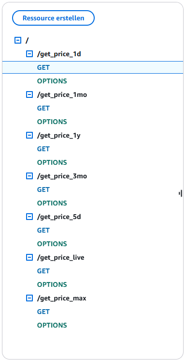
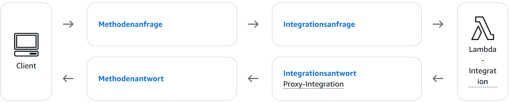

# Stock Data Api (free to use)

Free API to fetch stock data, based on the yfinance library.
Hosted with AWS.

## Usage: 
https://irp3olgj53.execute-api.eu-central-1.amazonaws.com/dev/get_price_[TIME_FRAME]?symbol=[STOCK_SYMBOL]
- TIME_FRAME: max, 1y, 3mo, 1mo, 5d, 1d, live
- STOCK_SYMBOL: e.g. AMZN, NVDA, BTC-USD, MSFT

Response:
Repsponses in JSON format. 
Example for the call "https://irp3olgj53.execute-api.eu-central-1.amazonaws.com/dev/get_price_1d?symbol=NVDA":

```
[
  {"date": "2024-11-15 09:30:00", "open": 144.8699951171875, "high": 145.24000549316406, "low": 144.7100067138672, "close": 144.7899932861328, "volume": 15478197.0, "dividends": 0.0, "stock_splits": 0.0, "name": "NVIDIA Corporation"},
  {"date": "2024-11-15 09:31:00", "open": 144.79600524902344, "high": 145.08999633789062, "low": 144.22000122070312, "close": 144.31069946289062, "volume": 1572787.0, "dividends": 0.0, "stock_splits": 0.0, "name": "NVIDIA Corporation"},
  {"date": "2024-11-15 09:32:00", "open": 144.30999755859375, "high": 144.5825958251953, "low": 144.16000366210938, "close": 144.28500366210938, "volume": 1044703.0, "dividends": 0.0, "stock_splits": 0.0, "name": "NVIDIA Corporation"},
  ...
] 
```

## Description

I wanted to create a stock tracker application with JavaScript to watch live stock data price and display historical stock data in diagrams. 
Therefore an API is necessary, to get the stock data.
Most available API's related to stock data have either free trials, which are not very practicable to use or are not free to use. 
As yahoofinance is free to use, i initially wanted to create a webscraping-tool, which scrapes the yahoofinance page.
Turns out that theres a library called yfinance, which is open source and able to fetch data of the yahoofinance page.
So i created an Api with python which is hosted with AWS Lambda.

<table>
  <tr>
    <td>
      <strong>Routes in AWS:</strong><br>
    </td>
    <td>
      <strong>Get methods in AWS:</strong><br>
    </td>
  </tr>
  <tr>
    <td>
      
    </td>  
    <td>
      
    </td>
  </tr>
</table>


## License

This project is licensed under the MIT License - see the LICENSE.md file for details
